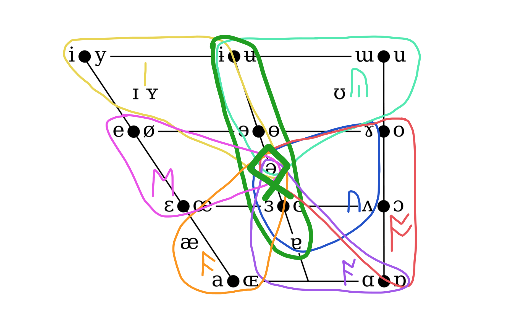

This post is to answer some questions that you may have about the [Rune School spelling system](/rune-school-spelling-system/).

# What about my accent?

## Non-rhotic

Firstly, this system is designed to allow you to drop Rs if you wish to. For example, if you are speaking to a non-rhotic audience, you may wish to write more exactly in your accent.

However, it is this author's understanding that many non-rhotic speakers consider "spar" to be a different phoneme from "spa" even if they sound the same when spoken. "Spar" has a potential linking-r while the other does not. 

Provided that this is true, what the non-rhotic speaker may desire is just a better way to show that some phonemes have this linking-r potential while others do not.

In this runic writing system, we allow for bindrunes to show exactly this.

| Latin | Standard without bindrunes | R dropping | Standard with bindrunes |
| --- | --- | --- | --- | 
| Square | ᛖᛖᚱ | ᛖᛖ |  | 
| NEAR | ᛠᚱ | ᛠ |  |
| Spar | ᚪᚱ | ᚪ |  |
| NORTH | ᚩᚱ | ᚩᚩ |  |
| lettER | ᛟᚱ | ᛟ |  |
| CURE | ᚣᚱ | ᚣᚣ |  |
| NURSE | ᚢᚱ | ᚢᚢ |  |

"Know your audience". This system is capable of being flexible depending on your needs. Bindrunes are probably the ideal, but since they are not yet common, we would always recommend writing the Rs for an international audience.

## Rhotic

Similar to the above, you may wish to remove some schwas ᛟ that are obvious to you if you're writing to other rhotic speakers.

| Latin | Standard | Rhotic emphasis |
| --- | --- | --- | 
| Hire | ᚻᚫᛡᛟᚱ | ᚻᚫᛡᚱ |
| Higher | ᚻᚫᛡᛟᚱ | ᚻᚫᛡᚱ |
| Runner | ᚱᚢᚾᛟᚱ | ᚱᚢᚾᚱ |
| Hour | ᚫᚹᛟᚱ | ᚫᚹᚱ |
| Fewer | ᚠᛡᚣᚹᛟᚱ | ᚠᛡᚣᚹᚱ |
| They're | ᚦᛖᛡᛟᚱ | ᚦᛖᛡᚱ |

For the rhotic speaker, The schwa is automatically inserted between consonants (and semivowels ᚹ/ᛡ) and ᚱ.

But you may wish to retain the schwa in cases where there is an obvious suffix like -er.

| Latin | Standard | Rhotic |
| --- | --- | --- | 
| Runner | ᚱᚢᚾᛟᚱ | ᚱᚢᚾᛟᚱ |
| Higher | ᚻᚫᛡᛟᚱ | ᚻᚫᛡᛟᚱ |

As with the above [non-rhotic](#non-rhotic) advice, bindrunes would be preferable.

## Yods and Yod coalescence

To understand what this is, let's look at some examples

| Latin | Yod dropping | Standard | Yod coalescence |
| --- | --- | --- | 
| Dune | ᛞᚣᚹᚾ | ᛞᛡᚣᚹᚾ | ᚷᚣᚹᚾ |
| Tube | ᛏᚣᚹᛒ | ᛏᛡᚣᚹᛒ | ᚳᚣᚹᛒ |

The ᛡ is either dropped or combines with the consonant before it to change the consonant sound.

For communicating internationally, we are going to recommend the [Goldilocks principle](https://en.wikipedia.org/wiki/Goldilocks_principle) and take the middle path of the Yod if at all possible. However, there are some instances where Yod coalescence is very common. Quoting the Shavian ReadLex:

> Yod-coalescence is generally accepted where it occurs in RP and GA, so ‘fortune’ is /fɔː(r)tʃuːn/ ᚠᚩᚱᛏᚣᚹᚾ not /fɔː(r)tjuːn/ ᚠᚩᚱᛏᛡᚣᚹᚾ. However, where GA pronounces a plain /uː/ with no ‘yod’, and RP has a ‘yod’, then for intelligibility the ‘yod’ is retained uncoalesced, so ‘aptitude’ is /æptɪtjuːd/ ᚫᛈᛏᛁᛏᛡᚣᚹᛞ, not /æptɪtʃuːd/ ᚫᛈᛏᛁᚳᚣᚹᛞ.

As always, if you know your audience, write how you wish! Use your own judgement.

## NEAR or SQUARE sounds different

NEAR and SQUARE lexical sets are hard to pin down. You could pronounce either of them in one of these three boxes (red, purple, blue).

In this approach, we are going with the [Goldilocks principle](https://en.wikipedia.org/wiki/Goldilocks_principle). Not hot (red), not cold (blue), but just right (purple). 

This allows us, among other things, to provide more fine distinctions like the below.

| Latin | Runes |
| --- | --- | 
| fairy / ferry | ᚠᛖᛖᚱᛄ / ᚠᛖᚱᛄ |
| there / they're | ᚦᛖᛖᚱ / ᚦᛖᛡᛟᚱ |
| mirror / nearer | ᛗᛁᚱᛟᚱ / ᚾᛠᚱᛟᚱ |
| Sirius / Serious | ᛋᛁᚱᛠᛋ / ᛋᛠᚱᛠᛋ |
| keyring / hearing | ᛣᛇᚱᛁᛝ / ᚻᛠᚱᛁᛝ |

## Merge Mary Merry and Marry

If Mary, merry, and marry all sound the same to you, you could spell all of them with ᛖᚱ or the bindrune of ᛖᚱ .

The standard spelling of this system however accounts for all three of these phonemes being distinct. It may benefit you to learn the distinctions nonetheless.

The [following table](https://en.wikipedia.org/wiki/English-language_vowel_changes_before_historic_/r/#Mary%E2%80%93marry%E2%80%93merry_merger) shows all of the potential homophones that can be distinguished by spelling these three phonemes differently.

| /ær/ ᚫᚱ | /ɛər/ ᛖᛖᚱ | /ɛr/ ᛖᚱ | IPA | Notes |
|------|-------|------|-----|-------|
| - | Aaron | [Erin](https://en.wikipedia.org/wiki/Erin) | ˈɛrən | [with weak-vowel merger](https://en.wikipedia.org/wiki/Weak-vowel_merger) |
| apparel | - | a peril | əˈpɛrəl | [with weak-vowel merger](https://en.wikipedia.org/wiki/Weak-vowel_merger) |
| arable | airable | errable | ˈɛrəbəl | - |
| - | airer | error | ˈɛrə(r) | - |
| barrel | - | beryl | ˈbɛrəl | with weak-vowel merger before /l/ |
| barrier | - | burier | ˈbɛriə(r) | - |
| [Barry](https://en.wikipedia.org/wiki/Barry_(name)) | - | berry | ˈbɛri | - |
| Barry | - | bury | ˈbɛri | - |
| [Carrie](https://en.wikipedia.org/wiki/Carrie_(name)) | [Cary](https://en.wikipedia.org/wiki/Cary_(disambiguation)) | [Kerry](https://en.wikipedia.org/wiki/Kerry_(name)) | ˈkɛri | - |
| carry | Cary | [Kerry](https://en.wikipedia.org/wiki/Kerry_(disambiguation)) | ˈkɛri | - |
| - | chary | cherry | ˈtʃɛri | - |
| - | dairy | [Derry](https://en.wikipedia.org/wiki/Derry) | ˈdɛri | - |
| - | fairy | ferry | ˈfɛri | - |
| [Farrell](https://en.wikipedia.org/wiki/Farrell_(surname)) | - | feral | ˈfɛrəl | with weak-vowel merger before /l/ |
| farrier | - | ferrier | ˈfɛriə(r) | - |
| farrow | [Faroe](https://en.wikipedia.org/wiki/Faroe_Islands) | - | ˈfɛroʊ | - |
| farrow | pharaoh | - | ˈfɛroʊ | - |
| harrowing | - | heroin | ˈhɛroʊɪn | [with G-dropping](https://en.wikipedia.org/wiki/G-dropping) |
| harrowing | - | heroine | ˈhɛroʊɪn | [with G-dropping](https://en.wikipedia.org/wiki/G-dropping) |
| [Harry](https://en.wikipedia.org/wiki/Harry_(given_name)) | hairy | - | ˈhɛri | - |
| - | haring | herring | ˈhɛrɪŋ | - |
| [Harold](https://en.wikipedia.org/wiki/Harold_(given_name)) | - | herald | ˈhɛrəld | - |
| marry | [Mary](https://en.wikipedia.org/wiki/Mary_(given_name)) | merry | ˈmɛri | - |
| parish | - | perish | ˈpɛrɪʃ | - |
| parry | - | [Perry](https://en.wikipedia.org/wiki/Perry) | ˈpɛri | - |
| - | scary | skerry | ˈskɛri | - |
| - | [Tara](https://en.wikipedia.org/wiki/Tara_(disambiguation)) | [Terra](https://en.wikipedia.org/wiki/Terra_(disambiguation)) | ˈtɛrə | - |
| - | Tara | terror | ˈtɛrə | non-rhotic |
| tarrier | - | terrier | ˈtɛriə(r) | - |
| tarry | - | [Terry](https://en.wikipedia.org/wiki/Terry) | ˈtɛri | - |
| - | tearable | [terrible](https://en.wiktionary.org/wiki/terrible) | ˈtɛrəbəl | with weak-vowel merger before /b/ |
| - | tearer | terror | ˈtɛrə(r) | - |
| - | vary | very | ˈvɛri | - |
| - | wary | wherry | ˈwɛri | [with wine–whine merger](https://en.wikipedia.org/wiki/Wine%E2%80%93whine_merger) |

## Don't have the FACE merger

If you don't have the FACE merger and instead have two distinct lexical sets of PANE and PAIN, I would suggest that you use a bindrune of ᛖ‍ᛡ for the PANE set to indicate that it is a closer monophthong and an unbound combination of ᛖᛡ for PAIN to indicate that it is the full diphthong.

## Don't have NURSE merger

If you don't have the NURSE merger and instead pronounce "fur", "fir", and "fern" distinctly, I recommend spelling each with ᚢᚱ, ᛁᚱ, and ᛖᚱ respectively.

The [chart below](https://en.wikipedia.org/wiki/English-language_vowel_changes_before_historic_/r/#Nurse_mergers) includes some potential homophones with this NURSE set of words. There are not too many cases where anyone would be confused by merging all of them.

| \*/ɛr/~/ər/ ᛟᚱ | \*/eːr/ ᛖᚱ | /ɪr/ ᛁᚱ | /ʌr/ ᚢᚱ | IPA | Notes |
|-------------|---------|------|-------|-----|-------|
| [Bern](https://en.wikipedia.org/wiki/Bern "Bern") | - | - | burn | ˈbɜː(r)n | |
| [Bert](https://en.wikipedia.org/wiki/Bert_(name) "Bert (name)") | - | - | Burt | ˈbɜː(r)t | |
| - | - | bird | burred | ˈbɜː(r)d | |
| [Bertie](https://en.wikipedia.org/wiki/Bertie_(given_name) "Bertie (given name)") | - | birdie | - | ˈbɜː(r)ɾi | With [flapping](https://en.wikipedia.org/wiki/Flapping "Flapping"). |
| berth | - | birth | - | ˈbɜː(r)θ | |
| - | earn | - | urn | ˈɜː(r)n | |
| [Ernest](https://en.wikipedia.org/wiki/Ernest "Ernest") | earnest | - | - | ˈɜː(r)nɪst | |
| [Ferd](https://en.wikipedia.org/wiki/Ferd_(nickname) "Ferd (nickname)") | - | - | furred | ˈfɜː(r)d | |
| herd | heard | - | [Hurd](https://en.wikipedia.org/wiki/Hurd "Hurd") | ˈhɜː(r)d | |
| herl | - | - | hurl | ˈhɜː(r)l | |
| - | [Hearst](https://en.wikipedia.org/wiki/Hearst_(disambiguation) "Hearst (disambiguation)") | - | hurst | ˈhɜː(r)st | |
| - | - | fir | fur | ˈfɜː(r) | |
| hertz; [Hertz](https://en.wikipedia.org/wiki/Hertz "Hertz") | - | - | hurts | ˈhɜː(r)ts | |
| kerb | - | - | curb | ˈkɜː(r)b | |
| mer- | - | myrrh | murr | ˈmɜː(r) | |
| - | - | mirk | murk | ˈmɜː(r)k | |
| per | - | - | purr | ˈpɜː(r) | |
| [Perl](https://en.wikipedia.org/wiki/Perl "Perl") | pearl | - | - | ˈpɜː(r)l | |
| tern | - | - | turn | ˈtɜː(r)n | |
| were | - | whirr | - | ˈwɜː(r) | With [_wine_–_whine_ merger](https://en.wikipedia.org/wiki/Wine%E2%80%93whine_merger "Wine–whine merger"). |
| - | - | whirl | whorl | ˈwɜː(r)l | |
| - | - | whirled | world | ˈwɜː(r)ld | With [_wine_–_whine_ merger](https://en.wikipedia.org/wiki/Wine%E2%80%93whine_merger "Wine–whine merger"). |

## Don't have NORTH-FORCE merger

If you don't have the NORTH-FORCE merger, you can spell NORTH words with ᚩᚱ and FORCE words with ᚩᚹᚱ. If there are no potential homophones that need distinguishing, it is recommended to stick with ᚩᚱ.

## Chews sounds different than choose

If "chews" sounds different than "choose", you can use ᛁᚹ for "chews" and ᚣᚹ for "choose".

## hUrry sounds different than fUrry

In this system, we have merged the historical ᛖᚱ and ᛁᚱ into ᚢᚱ for the NURSE phoneme. If you pronounce "hurry" like a true STRUT+R, you may write ᚢᚱ as a bindrune for NURSE and ᚢᚱ unbound for "hurry".

I don't believe however that there are any homophones that can be distinguished by pronouncing "hurry" and "furry" differently, however. So please drop by the discord and let us know if you found some!

## Merge commA and STRUT

Does commA sound the same as STRUT to you? STRUT ᚢ is stressed where commA ᛟ is not.

## Merge lettER and NURSE

Does lettER sound the same as NURSE to you? NURSE ᚢᚱ is stressed where lettER ᛟᚱ is not.

Here are some words that use **ᛟᚱ** where it's not the final part of a word. This should give you an idea of what is ᛟᚱ and what is ᚢᚱ.

**or**iginal, **ar**ound, **or**iginally, **ar**rested, **ar**rives, **ar**ray, **Ar**uba, **ar**ena, **ar**rangement, **ar**rival, **ar**isen, **ar**ranged, **ar**ight, **ar**ises, originality, **Ar**abian, **ar**omatherapy, c**or**onavirus, off**er**ing, m**ar**ine, p**ar**ental, lux**ur**y, Cam**er**on, prim**ar**y, t**er**rain, mem**or**ies, c**ar**eer, K**or**ea, Tàm**er**a, gall**er**y, deliv**er**y, summ**ar**y, sal**ar**y, conf**er**ence, manufact**ur**er, vict**or**y, cent**ur**y, op**er**a, v**ar**iety, sep**ar**ate, M**ar**iah, M**ar**ina, mot**or**ing, di**ar**y, temp**or**ary, ling**er**ie, P**er**u, groc**er**y, access**or**y, Gall**er**y, gen**er**ation, p**ar**ade

# I don't understand schwa

In the above (very chaotic) chart, the runes are placed where their "home" is. But each of these runes has the potential to stray from their home to various places.

When each rune strays from its home towards the *center* (in other words when it *weakens*), it switches to ᛟ.

Hypothetically, you could write in a way that doesn't use the schwa. It would be read as if English only had strong vowels. This could be helpful in situations that require more clear and enunciated sounds, like [choral singing](https://choralnet.org/archives/659186). 

But generally speaking, in this runic system, we want to actually show when a sound changes from one phoneme to another. So because of that, when a vowel strays into the center (AKA weakens), we swap it for ᛟ.

| Latin | Only Strong Vowels | Standard spelling |
| --- | --- | --- |
| moment | ᛗᚩᚹᛗᛖᚾᛏ | ᛗᚩᚹᛗᛟᚾᛏ |
| a | ᛖᛡ | ᛟ |
| incorruptible | ᛁᚾᛣᚩᚱᚢᛈᛏᛁᛒᚣᛚ | ᛁᚾᛣᛟᚱᚢᛈᛏᛟᛒᛚ |

# The article A

The sound in the article a can be a wide range of things.

* a = /e:~ə~ɐ/
* an = /æn~ən/

The Shavian standard spelling has opted to go with the schwa for the default phoneme for this, which is ᛟ/ᛟᚾ in our case.

It's not a bad solution considering that it is the weak pronunciation of both forms of the article, and this article is in the weak form most often. But what about when this article is in the strong form? Should we spell it ᛖᛡ or ᚫᚾ?

If we got into the habit of saying ᚫ can sometimes sound like ᛖᛡ, then we would have to start spelling words like angel as ᚫᚾᚷᛟᛚ and angle as ᚫᚾᚸᛟᛚ. And if we said that ᚫ can sometimes sound like ᛟ *in this one scenario*, then people would mistakenly spell words like "comma" like ᛣᚩᛗᚫ. In this spelling system, it is best to have more clear boundaries for phonemes so that the user can confidently spell things. If a sound goes from ᚫ to ᛖᛡ, we want to show that.

So why is ᛟ better? Just from an evidential standpoint, ᛟ is the only valid phoneme that is in *both* "a" and "an".

However, if you want to write in a way that clearly shows the exact pronunciation of a speaker, then maybe you would change ᛟ to ᛖᛡ or ᚫᚾ.

# commA or KIT

The confusion between commA ᛟ and KIT ᛁ stems from something called the Weak Vowel Merger.

The [following table](https://en.wikipedia.org/wiki/Phonological_history_of_English_close_front_vowels#Weak_vowel_merger) shows potential homophones that occur when you use commA ᛟ for everything:

| [/ə/](https://en.wikipedia.org/wiki/Help:IPA/English) | [/ɪ/](https://en.wikipedia.org/wiki/Help:IPA/English) | IPA | Notes |
|-------------------------------------------------------|-------------------------------------------------------|-----|-------|
| Aaron | Erin | ˈɛrən | [With](https://en.wikipedia.org/wiki/Mary-marry-merry_merger) [Mary-marry-merry merger](https://en.wikipedia.org/wiki/Mary-marry-merry_merger). |
| accede | exceed | əkˈsiːd | |
| accept | except | əkˈsɛpt | |
| addition | edition | əˈdɪʃən | |
| [Aleutian](https://en.wikipedia.org/wiki/Aleutian_(disambiguation)) | elution | əˈl(j)uːʃən | |
| allide | elide | əˈlaɪd | |
| allied | elide | əˈlaɪd | |
| allision | elision | əˈlɪʒən | |
| allude | elude | əˈl(j)uːd | |
| alluded | eluted | əˈl(j)uːɾəd | [With](https://en.wikipedia.org/wiki/Intervocalic_alveolar_flapping) [intervocalic alveolar flapping](https://en.wikipedia.org/wiki/Intervocalic_alveolar_flapping). |
| allusion | illusion | əˈl(j)uːʒən | |
| amend | emend | əˈmɛnd | |
| apatite | appetite | ˈapətaɪt | |
| arrays | erase | əˈreɪz | Some accents pronounce erase as /ɪˈreɪs/. |
| barrel | beryl | ˈbɛrəl | [With](https://en.wikipedia.org/wiki/Marry-merry_merger) [marry-merry merger](https://en.wikipedia.org/wiki/Marry-merry_merger). |
| battered | batted | ˈbætəd | [Non-rhotic](https://en.wikipedia.org/wiki/Rhotic_and_non-rhotic_accents) |
| bazaar | bizarre | bəˈzɑːr | |
| bettered | betted | ˈbɛtəd | [Non-rhotic](https://en.wikipedia.org/wiki/Rhotic_and_non-rhotic_accents) |
| bleachers | bleaches | ˈbliːtʃəz | [Non-rhotic](https://en.wikipedia.org/wiki/Rhotic_and_non-rhotic_accents) |
| bustard | busted | ˈbʌstəd | [Non-rhotic](https://en.wikipedia.org/wiki/Rhotic_and_non-rhotic_accents) |
| butchers | butches | ˈbʊtʃəz | [Non-rhotic](https://en.wikipedia.org/wiki/Rhotic_and_non-rhotic_accents) |
| buttered | butted | ˈbʌtəd | [Non-rhotic](https://en.wikipedia.org/wiki/Rhotic_and_non-rhotic_accents) |
| carat | caret | ˈkærət | |
| carrot | caret | ˈkærət | |
| censors | senses | ˈsɛnsəz | [Non-rhotic](https://en.wikipedia.org/wiki/Rhotic_and_non-rhotic_accents) |
| chartered | charted | ˈtʃɑːtəd | [Non-rhotic](https://en.wikipedia.org/wiki/Rhotic_and_non-rhotic_accents) |
| chattered | chatted | ˈtʃætəd | [Non-rhotic](https://en.wikipedia.org/wiki/Rhotic_and_non-rhotic_accents) |
| chiton | chitin | ˈkaɪtən | |
| chromous | chromis | ˈkroʊməs | |
| Devon | Devin | ˈdɛvən | |
| ferrous | Ferris | ˈfɛrəs | |
| foundered | founded | ˈfaʊndəd | [Non-rhotic](https://en.wikipedia.org/wiki/Rhotic_and_non-rhotic_accents) |
| humo(u)red | humid | ˈhjuːməd | [Non-rhotic](https://en.wikipedia.org/wiki/Rhotic_and_non-rhotic_accents) |
| installation | instillation | ˌɪnstəˈleɪʃən | |
| Lennon | Lenin | ˈlɛnən | [[36]](https://en.wikipedia.org/wiki/Phonological_history_of_English_close_front_vowels#cite_note-afterRP-36) |
| mandrel | mandrill | ˈmændrəl | |
| mastered | masted | ˈmæstəd, ˈmɑːstəd | [Non-rhotic](https://en.wikipedia.org/wiki/Rhotic_and_non-rhotic_accents) |
| mattered | matted | ˈmætəd | [Non-rhotic](https://en.wikipedia.org/wiki/Rhotic_and_non-rhotic_accents) |
| mergers | merges | ˈmɜːdʒəz | [Non-rhotic](https://en.wikipedia.org/wiki/Rhotic_and_non-rhotic_accents) |
| modern | modding | ˈmɒdən | Non-rhotic with G-dropping. |
| officers | offices | ˈɒfəsəz | [Non-rhotic](https://en.wikipedia.org/wiki/Rhotic_and_non-rhotic_accents) |
| omission | emission | əˈmɪʃən | |
| parody | parity | ˈpærəɾi | [With](https://en.wikipedia.org/wiki/Intervocalic_alveolar_flapping) [intervocalic alveolar flapping](https://en.wikipedia.org/wiki/Intervocalic_alveolar_flapping). |
| pattered | patted | ˈpætəd | [Non-rhotic](https://en.wikipedia.org/wiki/Rhotic_and_non-rhotic_accents) |
| pattern | patting | ˈpætən | Non-rhotic with G-dropping. |
| pigeon | pidgin | ˈpɪdʒən |

There is a difference however between weak vowel mergers in final syllabes vs otherwise.

For example, in the phrase "Rosa's roses", the Shavian ReadLex standard (the one that we follow) uses the commA letter ᛟ for both of the final vowels. But in the words "allude" and "elude", it uses ᛟ for the first and ᛁ for the second.

| Latin | Readlex (Shavian) | Rune School Standard |
| --- | --- | --- | 
| Rosa's | 𐑐𐑸𐑑𐑩𐑛 | ᚱᚢᚹᛉᛟᛉ |
| roses | 𐑮𐑴𐑟𐑩𐑟 | ᚱᚢᚹᛉᛟᛉ | 
| bazaar | 𐑚𐑩𐑟𐑸 | ᛒᛟᛉᚪᚱ |
| bizarre | 𐑚𐑦𐑟𐑸  |  ᛒᛁᛉᚪᚱ | 

# Why ᚫ for diphthongs instead of ᚪ

There are 7 main vowel runes in the lexical sets chart

Each column is a pattern that is applied to the *main* vowel rune on the far left. A shortcut rune like ᛠ or ᚪ doesn't carry over into other columns. We only apply patterns onto the main rune on the far left, not onto shortcut runes. 

Each main vowel rune contains within it the potential for all of the phonemes in the rightward patterns. This means that ᚫ contains ᚫᚫ (ᚪ) within it. We don't write ᚫᚫᚹ or ᚫᚫᛡ, so we also don't write ᚪᚹ or ᚪᛡ. However, if you do, I don't think anyone would be confused.
